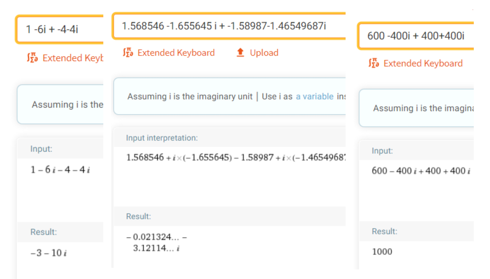
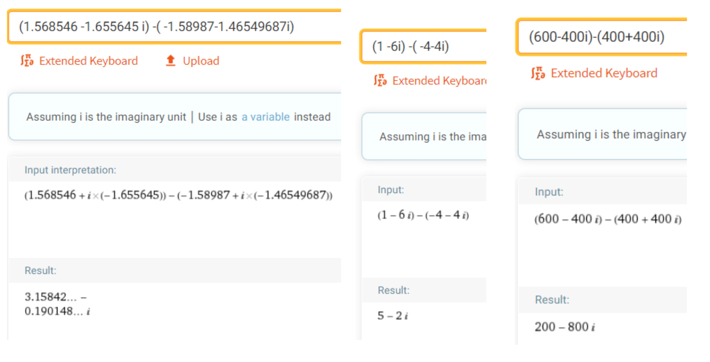
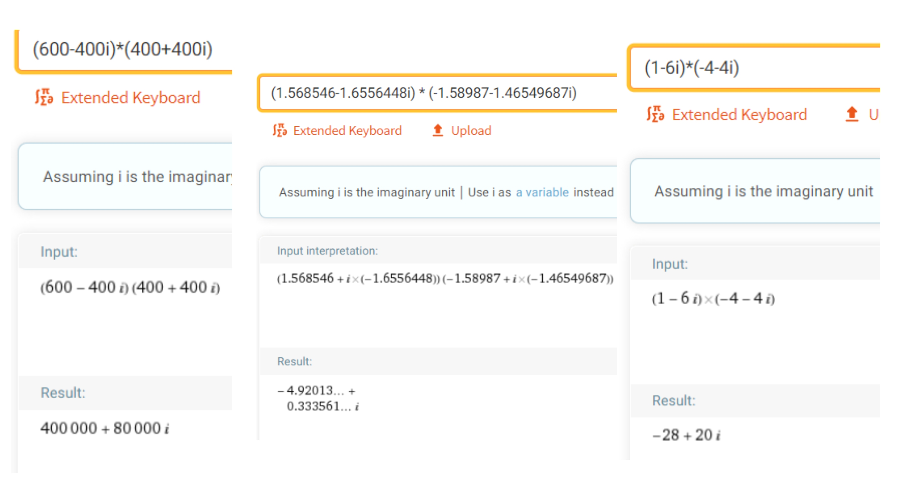
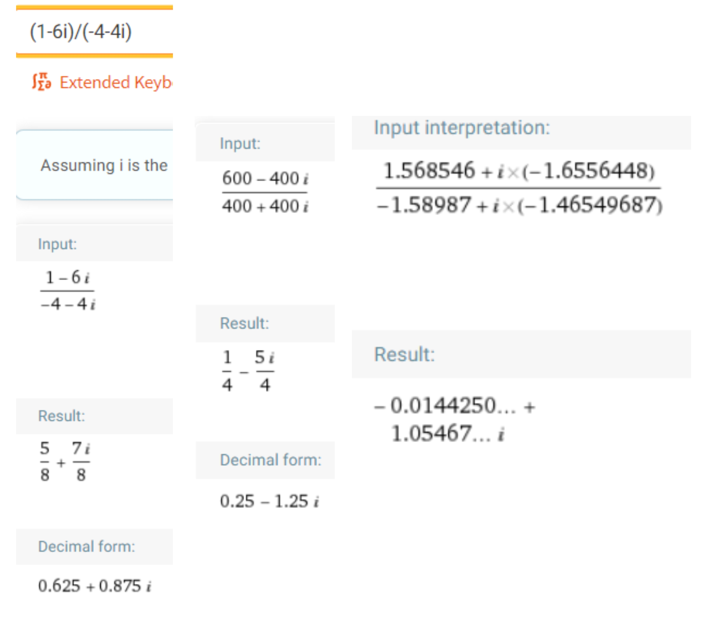
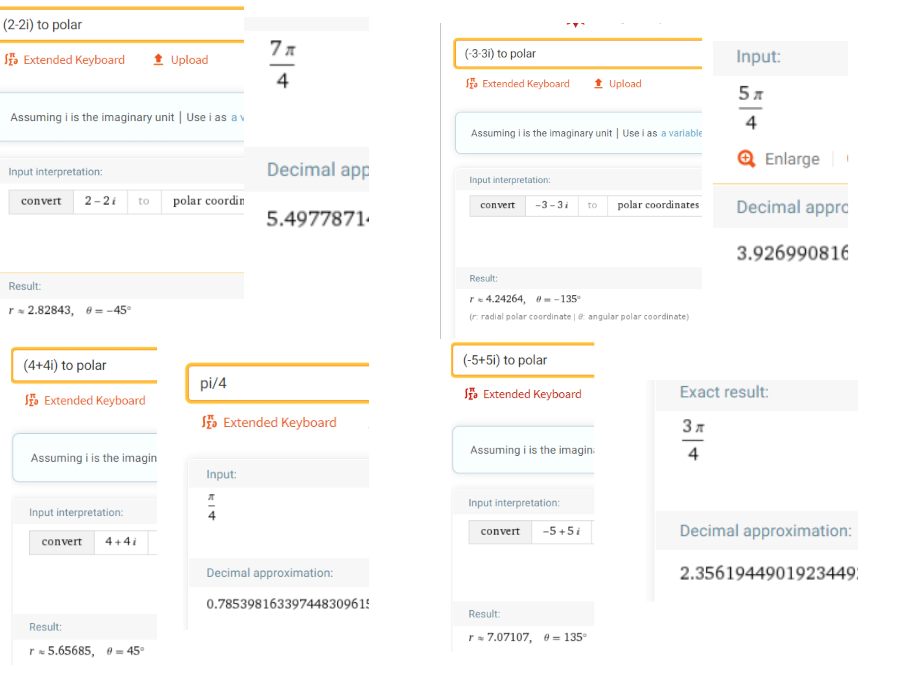

## Programado por : Julian Eduardo Arias Barrera
### Contenido:
1) Descripcion
2) Documentacion
3) Informacion al Usuario
4) Pruebas
### 1) Descripcion:
Este proyecto es una libreria que permitira generar una representacion de numeros complejos y realizar diversas operaciones con ellas, hecho en python como la clase "complejo".

Contiene las funciones de : 
- Creacion del numero complejo por coordenadas polares o cartesianas.
- Suma y resta , entre dos complejos
- Division y Multiplicacion  , entre dos complejos
- Potencia , de un complejo elevado a uno entero.
- Impresion en forma Polar y Cartesiana, una vez creado.
### 2) Documentacion :
## [Documentacion (click)](https://htmlpreview.github.io/?https://github.com/AriasAEnima/CNYT/blob/master/Librerias/Numeros_Complejos/html/libreriacomplejos.html)

### 3) Informacion al Usuario :

## [Ejemplo de uso libreria (click)](https://github.com/AriasAEnima/CNYT/blob/master/Librerias/Numeros%20complejos.ipynb)

### 4) Pruebas:
Se realizaron 3 a 4 pruebas por funcion aqui muestro cuales de estas se corrieron y concordaron 
con el resultado:

* Suma:

* Resta:

- Producto:

- Divison:

- Potencia:

- Polar y Cartesiana:

Debemos tener en cuenta que en dara un numero aproximado a lo que deberia dar en las pruebas de cartesiana a polar y viseversa, pasando la prueba aproximado a 5 decimales con los mismos numeros. El angulo valuara el numero π por lo tanto se muestra al lado el numero aprox de rads equivalente al angulo en grados que nos muestra wolfram.

